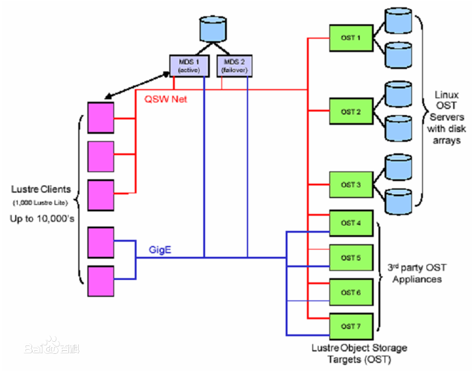

Lustre是HP, Intel，Cluster File System公司联合美国能源部开发的Linux集群并行文件系统。该系统已推出 1.0 的发布版本，是第一个基于对象存储设备的，开源的并行文件系统。其结构如图所示，它由客户端，两个MDS，OSD 设备池通过高速的以太网或 QWS Net 所构成。可以支持1000 个客户端节点的 I/O 请求，两个 MDS 采用共享存储设备的 Active－Standby方式的容错机制，存储设备跟普通的，基于块的 IDE 存储设备不同，是基于对象的智能存储设备。

Lustre 采用分布式的锁管理机制来实现并发控制，元数据和文件数据的通讯链路分开管理。与 PVFS 相比，Lustre 虽然在性能，可用性和扩展性上略胜一踌，但它需要特殊设备的支持，而且分布式的元数据服务器管理还没有实现。

注：PVFS： Clemson 大学的并行虚拟文件系统（PVFS） 项目用来为运行 Linux 操作系统的 PC 群集创建一个开放源码的并行文件系统。PVFS 已被广泛地用作临时存储的高性能的大型文件系统和并行 I/O研究的基础架构。 作为一个并行文件系统，PVFS 将数据存储到多个群集节点的已有的文件系统中,多个客户端可以同时访问这些数据。
