# zone

什么是zone？如何做zone？如何做好zone？

## 一、什么是zone？

Zone是FC-SAN交换机上的一种独有的逻辑配置，通过配置特定的设备加入zone，从而允许设备之间互相通信。当交换机上配置了zone时，同在一个zone里的设备之间可以互相通信，没有加入任何zone的设备不能与其他设备通信。

早期交换机厂商根据zone的实现方式，把zone分为hard zone和soft zone，区别在于前者通过硬件芯片来实现，后者通过软件来实现。后来大家把基于domain ID/端口号的zone叫做hard zone，基于wwn的zone为soft zone。现在这两种类型的zone都是基于硬件芯片实现。

### Zone的类型

#### 1.  基于Domain ID/端口号(D,P)的普通zone模式

这种zone允许接在某几个端口上的设备互相通信，即使端口上的设备改变也不会影响zone的使用，在更换主机HBA卡时不需要进行任何zone配置的更改。

#### 2.  基于wwpn/wwnn的普通zone模式

这种zone允许拥有特定wwn的设备之间互相通信，不关心设备接在交换机的哪个口上。当某个设备从一个端口移到另一个端口时，不需要进行任何zone配置的更改。但更换主机HBA卡时，需要根据新HBA卡的wwn更改zone配置。注意如果交换机上接有NPIV模式的刀片交换机或主机集群时，必须使用基于wwn的zone。

#### 3.  混合zone(session based hard zoning)

当一台设备在两个或多个zone里分别使用D,P和wwn模式的zone，这台设备会进入混合zone模式。在混合zone模式里的设备在跟其他设备通信时需要通过交换机CPU进行软件验证。

#### 4.  LSAN zone

LSAN zone只有在启用了FCR时才会被应用到，它能允许在不同的fabric中的设备通过fc router进行通信。需要在交换机上安装integrated routing license后才能打开FCR功能。

#### 5.  TI zone(Traffic Isolation zone)

TI zone可以把一根或者多根ISL设置成某个zone的专用ISL，不需要license。

#### 6.  QOS zone

QOS zone在网络中出现拥堵时可以允许高QOS的zone成员优先通信，需要在交换机上安装adaptive networking license。

Zoneset是zone的集合。一台交换机同时只能启用一个zoneset，同一个SAN网络中交换机的active zoneset必须保持一致，不然会造成网络分裂(fabric segment)。

Alias，或叫做别名，是使配置zone更简便的一个功能。对于每台设备，可以预先设置好alias，之后在配置zone时使用alias来代替D,P或wwn。

Default zone：思科与博科交换机都有default zone，它的功能是在没有任何zone配置时允许所有连接在交换机上的设备互相通信。

## 二、如何做zone？

### 博科交换机CLI命令行

首先对每个需要做zone的设备创建alias，然后创建zone并把alias加入，创建cfg(zoneset)并把需要的zone加入，最后启用cfg。

帮助命令： zonehelp

显示现有配置：cfgshow

创建/增加成员/移除成员/删除alias：
```sh
​     alicreate "aliName","member[; member...]"

​     aliadd "aliName","member[; member...]"

​     aliremove "aliName","member[; member...]"

​     alidelete "aliName"
```
创建/增加成员/移除成员/删除zone:
```sh
​     zonecreate "zonename", "member[;member...]"

​     zoneadd "zoneName", "member[;member...]"

​     zoneremove "zoneName", "member[;member...]"

​     zonedelete "zoneName"
```
注意：根据zone的最佳实践，EMC推荐每个zone里只放一个initiator(主机，Vplex的BE口等)。多个initiator互相zone在一起会导致很多反常现象。

创建/增加成员/移除成员/删除cfg：
```sh
​     cfgcreate "cfgName", "member[;member...]"

​     cfgadd "cfgName", "member[;member...]"

​     cfgremove "cfgName", "member[;member...]"

​     cfgdelete "cfgName", "member[;member...]"
```
保存/启用cfg：
```sh
​     cfgsave

​     cfgenable "cfgName"
```
注意：激活某个cfg会使其他正被使用cfg停止工作，一个fabric里同时只能有一个cfg处于工作状态。

更改default zone配置：
```sh
​     defzone [--noaccess | --allaccess | --show]
```
### 博科交换机GUI界面

进入webtools后点击Zone Admin，进入zone配置界面。

V6.x.x界面：

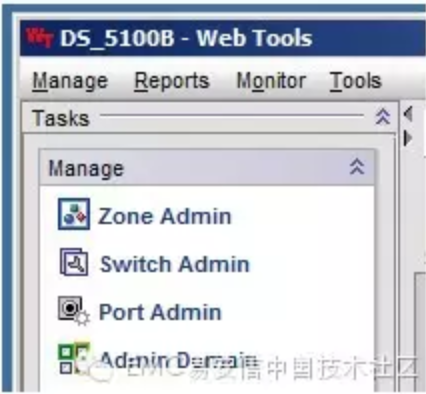

V7.x.x界面：

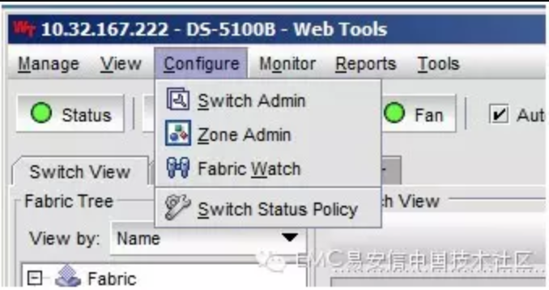

进入Zone Admin后v6.x.x与v7.x.x版本的界面基本一致。


#### 创建alias

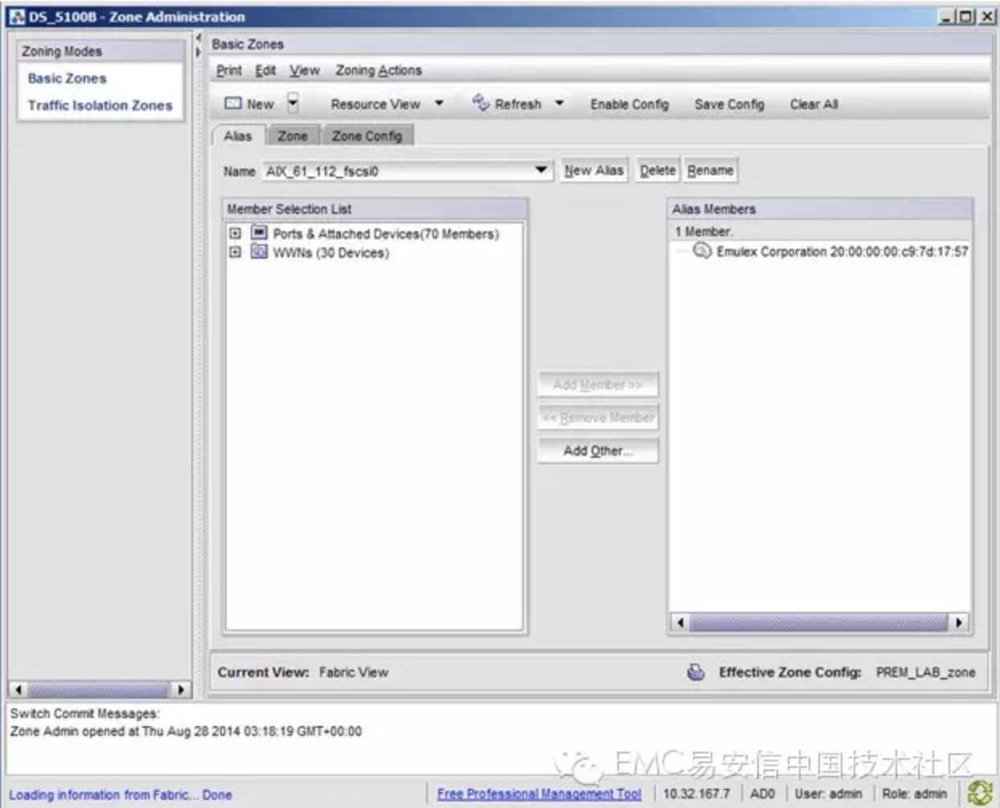

点击New键或右边的new alias键，输入alias名字，注意只能输入数字字母或下划线。

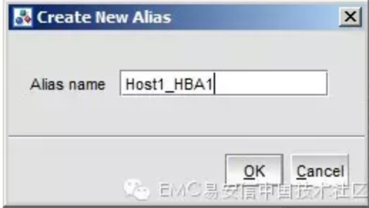

点击OK后注意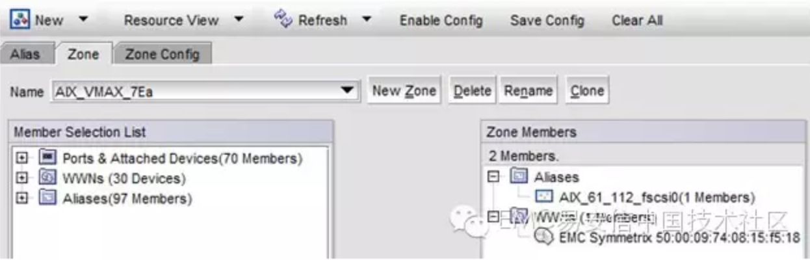
栏内已经显示刚才输入的alias名字，然后从左边的列表里选中相应的wwn或交换机端口，点击add member键加入右边的alias members里。

#### 创建zone并添加成员

选中标签页中的zone标签，点击New按键，输入zone名字并点击OK。

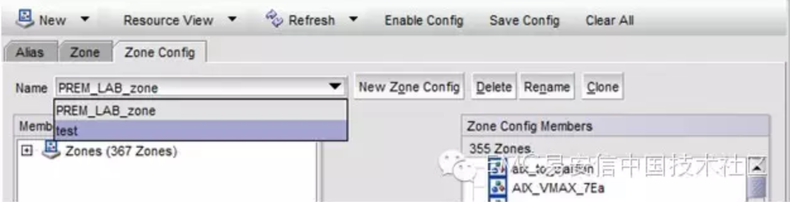

然后从左边列表里选中相应的wwn，交换机端口或之前设置好的alias，点击add member键加入右边的zone members里。

注意：根据zone的最佳实践，EMC推荐每个zone里只放一个initiator(主机，Vplex的BE口等)。多个initiator互相zone在一起会导致很多反常现象。

#### 创建cfg并添加成员

选中标签页中的zone config标签，点击New键，输入cfg的名字并点击OK。


然后从左边列表里选中相应的zone，点击add member键加入到右边的zone config members里。

#### 保存并激活cfg

选中标签页中的zone config标签，查看name右边下拉菜单，确认当前的cfg是需要激活的cfg。

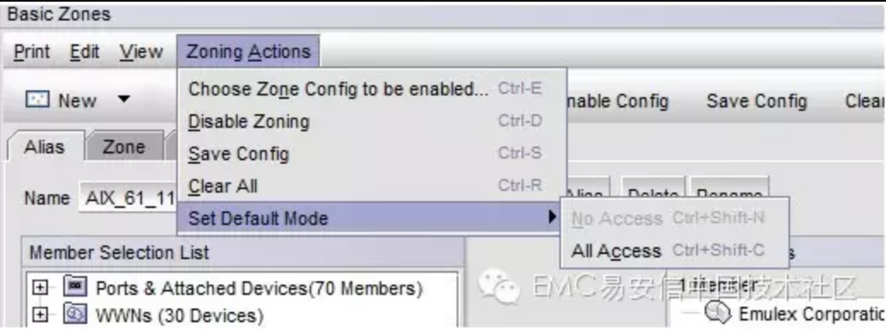

点击save config按钮，保存之前更改好的cfg。

点击enable config按钮，激活当前选中的cfg。

注意：激活某个cfg会使其他正被使用cfg停止工作，一个fabric里同时只能有一个cfg处于工作状态。

#### 更改default zone配置

点选zoning actions菜单，选中set default mode里的no access或all access。

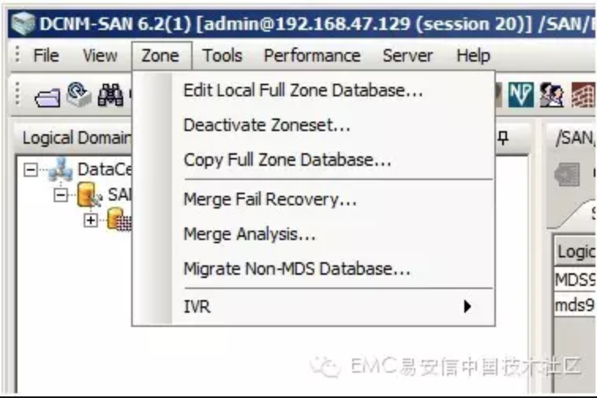

### 思科交换机CLI命令行

思科交换机与博科交换机最大的不同就是vsan，每个vsan都拥有自己独立的zone和zoneset。

其次还有enhanced zoning与basic zoning的区别。

enhanced zoning会在用户试图更改zone配置时创建一个session，防止其他用户同时更改配置造成配置丢失。开启了enhanced zoning功能的交换机在做完zone配置更改之后需要commit以使配置生效并关闭session。

另外需要注意的是enhanced zoning会自动开启广播zone，而MDS9500系列在升级到第四代端口板的时候需要禁用广播zone才能是第四代端口板生效。

显示命令：
```sh
​     # show fcalias vsan x

​     # show zoneset vsan x

​     # show active zoneset vsan x

​     # show zone status vsan x
```
启用enhanced zoning：
```sh
​     # configure terminal

​     (config)# zone mode enhanced vsan x
```
更改alias：
```sh
​     (config)# fcalias name A123 vsan x

​     (config-fcalias)# member pwwn 10:00:00:00:00:00:00:00

​     (config-fcalias)# exit

​     (config)# zone commit vsan x
```
更改zone：
```sh
​     (config)# zone name zone123 vsan x

​     (config-zone)# member interface fc1/1

​     (config-zone)# member pwwn 20:00:00:00:00:00:00:00

​     (config-zone)# member fcalias A123

​     (config-zone)# exit

​     (config)# zone commit vsan x
```
更改zoneset：
```sh
​     (config)# zoneset name zoneset123 vsan x

​     (config-zoneset)# member zone123

​     (config-zoneset)# exit

​     (config)# zone commit vsan x
```
激活zoneset(只在basic zone模式下有效)：
```sh
​     (config)# zoneset activate name zoneset123 vsan 1
```
禁用广播zone：
```sh
​     (config)# no zone broadcast enable vsan x
```
### 思科交换机GUI界面(DCNM与DCFM基本一致)

点击DCNM界面zone菜单中的edit local full zone database…

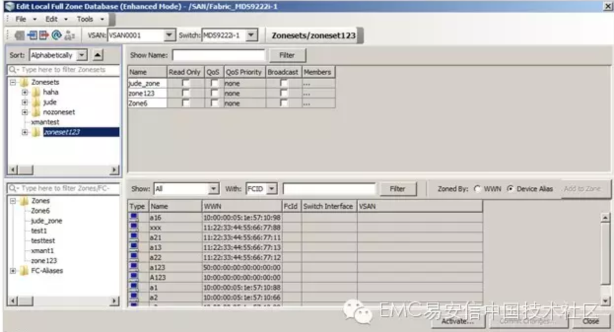

编辑zone的界面如下：

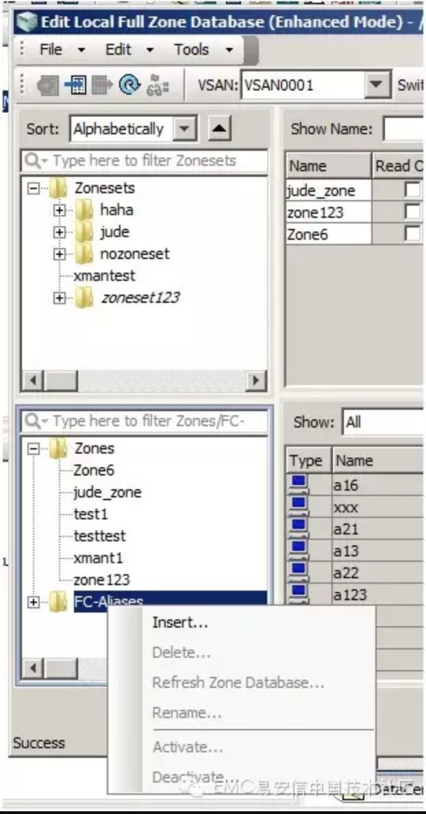

#### 编辑fcalias

首先在左下角找到fc-alias，右键点击insert并输入alias名和wwn：

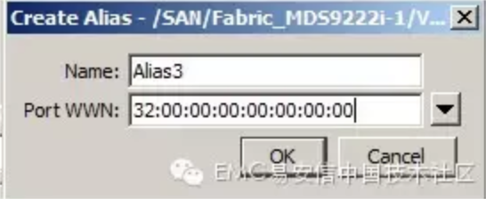

点击OK后创建alias的窗口并不会立刻关闭，可以更改alias名和wwn，再点击OK来连续创建其他alias。

#### 编辑zone

点击左下角的zones，右击并选中insert，可以创建zone。

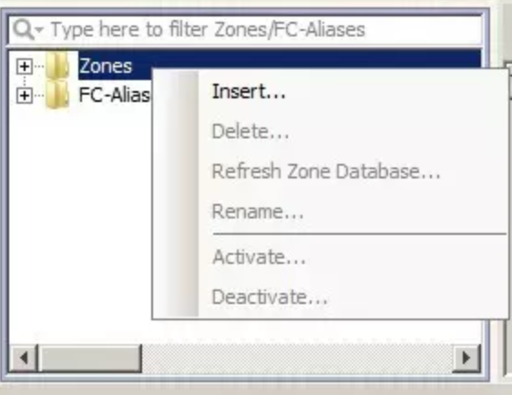

点击OK后会看到新创的zone显示在列表里，在左下角点开zones前的加号，选中新增的zone来编辑其成员。

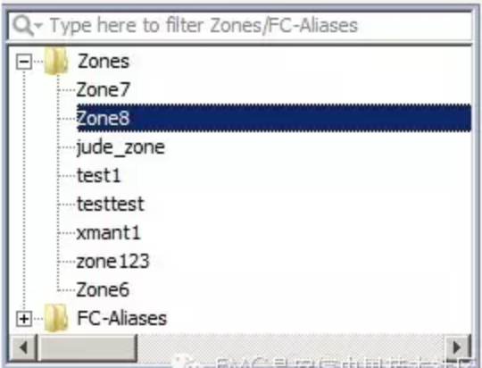

在右下角的列表里找到相应的wwn或device alias，点击add to zone加入到zone里，或在左下角把fcalias拖进相应的zone里。

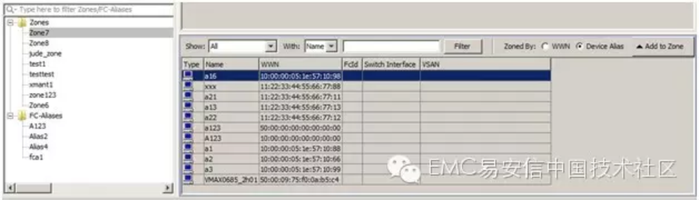

#### 编辑zoneset

把之前编辑好的zone从左下角拖进左上角的zoneset即可。

#### 确认编辑/激活zoneset

点击右下角的commit changes按钮，会把对该vsan做的更改发布到整个SAN网络里。

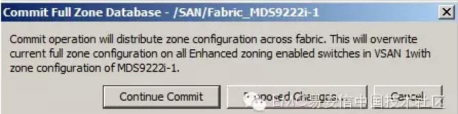

选中某个zoneset，点击右下角的activate按钮，会显示之前对这个zoneset做过的更改。

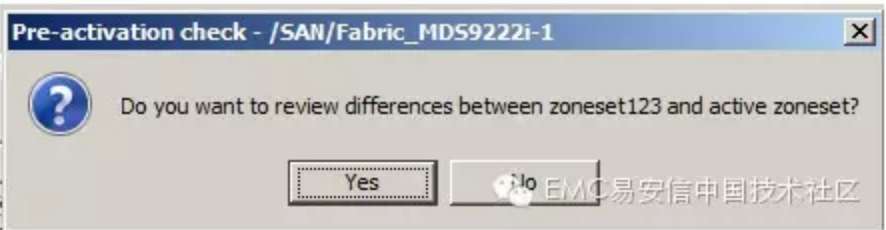


点击close之后显示保存running-config到startup-config的对话框，如果确实要执行该操作，打上选项前的勾并点击continue activation。

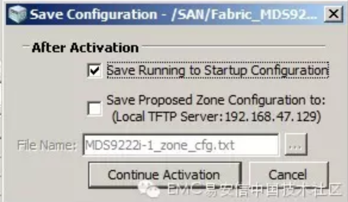

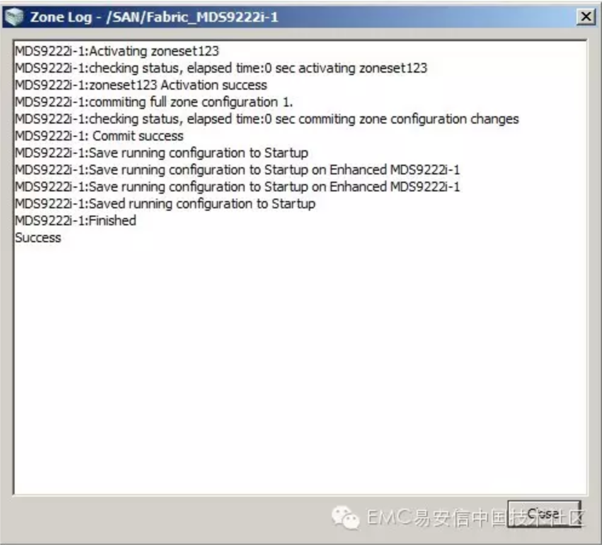

显示success了就说明激活zoneset并保存配置成功了。

## 三．如何做好zone

做一个zone很简单，但是如何做好zone，却要考虑到方方面面的问题。

1. 推荐使用wwn zone(客户有特殊要求或FICON环境除外)，原因如下：

   1. port zone只能通过物理隔离来保证zone安全，而wwn zone能限制只有指定设备才能访问zone。
   2. NPIV和AG环境中，只能使用wwn zone来划分zone给cluster上的主机或虚机。
   3. IVR/FCR和磁带加速技术只能使用wwn zone。

2. LUN masking和zone同时使用

   Zone和LUN masking都可以隔离主机和存储之间的通信，但是这两者作用在不同的层面。Zone在交换机上面生效，LUN masking在存储端口生效，两者无法做相互取代。

3. alias命名应该清晰易懂，确保不会混淆。

4. 博科交换机尽量避免使用混合zone模式。博科交换机在6.4.3之前有一个bug，会导致在混合zone里的主机自动登出存储。

5. 思科交换机使用enhanced zoning，防止多个用户同时更改zone配置导致配置丢失。

6. 关闭default zone，避免未经验证的设备登入网络。