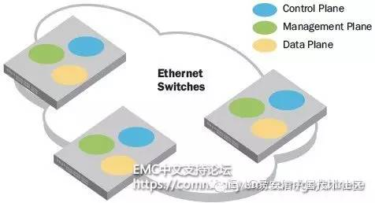
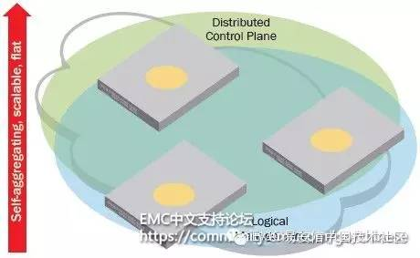

## 以太网矩阵(Ethernet Fabric)简介

数据中心网络依赖于以太网。在过去几十年中，伴随着新应用架构类型的不断涌现，以太网也在不断地发展变化。今天，数据中心网络负责传输多种应用的流量，包括客户端/服务器、Web服务、统一通信、虚拟机和存储流量。每种应用的流量模式和网络设备要求均有所不同。应用被大量地部署在在数据中心托管的服务器集群中的虚拟机上。以太网可用于构建共享存储池，这就对网络提出了苛刻要求，包括无损的数据包交付、确定性的延时和更高的带宽等。这些变化共同推动着以太网技术的下一轮发展：即以太网矩阵。

本文将介绍什么是以太网矩阵，以及它的优势所在。

## 传统以太网

为了更好地了解以太网矩阵，让我们先看看传统以太网。与单一以太网交换机提供的端口数相比，大多数数据中心需要更多端口，因此数据中心纷纷将多台交换机连接起来，形成一个可支持更多连接的网络。例如，服务器机架通常包括一台架顶式（ToR）交换机和多个服务器，多个这样的机架又连接到架端（EoR）交换机。所有这些以太网交换机都互相连接起来，形成一种分层或“以太网树状”拓扑，如下图所示。

在传统以太网中，交换机之间的连接，或者说交换机间互联链路（ISL，图中蓝色线条所示），不允许形成环路，否则帧就无法正常传输。生成树协议（STP）可创建一个任意两台交换机之间只有一条活动路径的树状拓扑，因此可以防止形成环路。（在图中，非活动路径用虚线表示。）这意味着ISL带宽仅限于单一逻辑连接，因为交换机间不允许建立多条连接。对以太网的增强试图突破这一局限性。业内开发了Link Aggregation Groups（LAG），将交换机间的多条链路作为单一连接进行处理而不形成环路。但是，LAG必须在LAG中的每个端口上手工进行配置，因此缺乏灵活性。

树状拓扑要求流量向树上方或下方（或者说“南北向（north-south）”）传输，才能达到相邻机架。在大多数接入流量在机架内不同服务器间传输时，这不成问题。但在服务器集群，如集群应用和服务器虚拟化所需的服务器集群中，流量在多个机架内的不同服务器之间传输，也就是沿“东西向（east-west）”传输，因此树状拓扑会由于存在多个中继段而增加延时，而且由于不同交换机之间只有一条链路而限制带宽。

某条链路丢失时，STP可自动恢复。然而，这会停止网络中的所有流量传输，而且必须在网络中的所有交换机之间重新收敛到一条路径才能重新开始流量传输。使所有链路上的所有流量传输停止数十秒甚至几分钟，会限制可扩展性，并将流量大量发送到可容忍数据路径阻塞以确保链路弹性的应用中。过去，流量依靠TCP来应对这种业务中断，但是今天，几乎所有数据中心应用都以24 x 7高可用性模式运行，而且以太网中的存储流量不断增加，因此数据路径哪怕中断几秒钟都是不可接受的。

最后，传统以太网交换架构还会带来其它限制。每台交换机都有自己的控制平面和管理平面。每个帧达到某个入站端口时，每台交换机都必须发现并处理每个帧的协议。随着更多交换机的添加，协议处理时间会导致延时不断增加。每台交换机和交换机中的每个端口都必须独立进行配置，因为不同交换机之间根本不共享通用配置和策略信息。复杂性不断提高，配置错误不断增加，而运营和管理资源却不能相应增加。

## 以太网矩阵架构

下图显示了传统以太网交换机的架构。控制平面、数据平面和管理平面从逻辑上通过背板（back plane）连接到每个端口上。控制和管理平面在交换机一级运行而不是在网络级运行。

以太网矩阵可以看作是将控制和管理平面从物理交换机扩展到Fabric架构中。如下图所示，它们现在在Fabric架构一级运行而不是在交换机一级运行。

在以太网矩阵中，控制平面采用链路状态路由代替STP，而数据路径在2层提供等价多路径转发，使数据始终可通过最短路径传输，使用多条ISL连接而不形成环路。与Fabric架构的控制平面相结合时，带宽扩展变得简单无比。例如在一台新交换机连接到Fabric架构中的任何其它交换机时，就可以自动形成新的捆绑链路。如果某捆绑链路出现故障或被删除，流量可以重新均衡到现有链路儿不中断业务。最后，如果一条ISL被添加到Fabric架构中或从中删除，其它ISL上的流量可继续传输而不会像使用STP时那样停止。

在这种架构中，一组交换机可定义为“逻辑机箱”的一部分，就像机箱式交换机中的接口板卡一样。这样就可以简化管理、监控和运行，因为策略和安全配置参数可在逻辑机箱中的所有交换机之间轻松共享。此外，与物理和虚拟服务器及存储设备的连接的信息并不发送给Fabric架构中的所有交换机，因此Fabric架构可确保所有网络策略及安全设置可继续用于任何给定的虚拟机，不管它是否移动，也不管它位于何处。

## 以太网矩阵的优势

与传统的分层以太网架构相比，以太网矩阵可提供更高的性能、利用率、可用性和操作简便性。至少，它们具有以下特征：

- 更扁平：以太网矩阵不再需要生成树协议（STP），但仍可与现有的以太网全面互操作。

- 灵活：可采用任何拓扑结构，来最有效地满足各种工作负载的需求

- 有弹性：使用多条“最低成本”路径来确保高性能和高可靠性

- 可扩展：可根据需要轻松地向上或向下扩展。

更先进的以太网矩阵从光纤通道Fabric架构设计中借鉴了更多：

- 它们可以自动形成，作为单一逻辑实体运行，其中的所有交换机都能自动识别彼此的存在，而且知道所有相连接的物理和逻辑设备。
- 管理可基于域而不是基于设备，并通过策略而不是重复的流程进行定义。
- 这些特性，再加上专门针对虚拟化进行的增强，可帮助更轻松地应对网络中的虚拟机自动化挑战，从而实现更高程度的IT自动化。
- 协议融合（如Fibre Channel over Ethernet，FCoE）也可以是更好地将LAN和SAN流量桥接起来的一个特性。