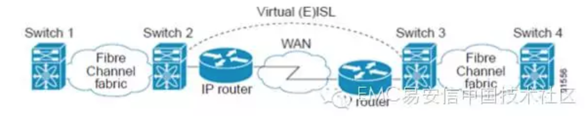
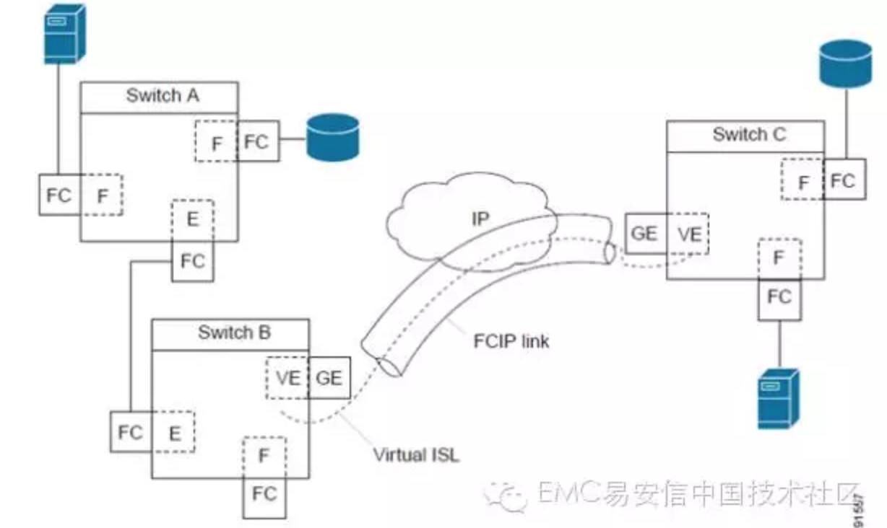
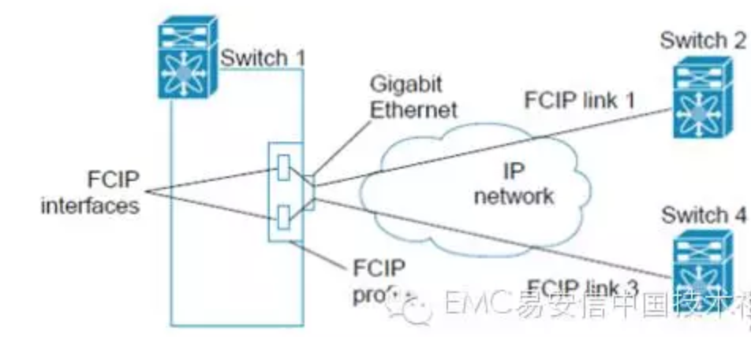

# FCIP基本概念

Cisco MDS 9000系列FCIP配置文档

## 什么是FCIP？

Fibre Channel over IP protocol（FCIP）是一种隧道协议。将多个物理独立分步的光纤SAN环境，通过IP LAN/MAN/WAN连接起来。示意图如下：

FCIP使用IP层作为网络，TCP作为传输层，TCP头部的DF位设置为1.

备注：更多关于FCIP协议信息，请参考IETF标准关于IP存储章节[http://www.ietf.org]()；或者参考光纤协议标准关于switch backbone connection章节[http://www.t11.org]()（FC-BB-2）.

本系列包含以下主要章节：

- FCIP概念
- FCIP高可用方案
- FCIP参数配置
- FCIP配置过程
- FCIP其他功能特性

## FCIP基本概念

FCIP功能支持可以通过Cisco IPS（ip storage）模块或者MPS (multiprotocol service) 模块获得，FCIP基本概念如下。

## FCIP和VE_Port

下图结合Fibre Channel ISL和Cisco EISL描述FCIP内部模型。

FCIP virtual E(VE) Ports在逻辑上于标准Fbire Channel E Ports一样，只是使用FCIP协议封装而不是Fibre Channel。FCIP协议要求链路两端都是VE Ports。

虚拟ISL链路通过FCIP链路建立，并在之上传输Fibre Channel数据帧。虚拟ISL链路和Fibre Channel ISL一样，两端是E Port或者TE Port。

## FCIP链路

FCIP链路由两个FCIP终端之间的一个或者多个TCP连接组成。每个链路携带FCIP协议封装过的光纤帧。当FCIP链路启动，FCIP链路两端的VE端口会创建一个virtual (E)ISL链路，并且初始化E端口协议拉起（E）ISL链路。

默认情况下，Cisco MDS 9000系列交换机会为每个FCIP链路创建两个TCP连接。

1. 一个连接用于数据帧传输
2. 另外一个连接用户Fibre Channel控制帧（所有F类型帧）。专门一个连接用于传输Fibre Channel控制帧是为了保证控制帧低延迟。

在IPS或者MPS模块上使用FCIP功能之前，首先需要配置FCIP interface和FCIP profile。

FCIP链路再两个节点之间建立成功只是，VE Port初始化过程与E Port一样。初始化过程与FCIP或者Fibre Channel无关，而是基于E Port发现过程（ELP，ESC）。在Fibre Channel层，E Port和VE Port是一样的。

## FCIP Profile

FCIP profile包含本地IP地址和TCP端口灯参数配置信息。FCIP profile的本地IP地址具体FCIP链路使用哪个Gigabit以太网口。

FCIP Profile与FCIP链路关系图如下：

## FCIP接口

FCIP接口是指FCIP链路本地以太网接口和VE Port接口。所有FCIP和E Port配置都是正对FCIP接口。

FCIP参数包含以下：

1. Gigabit以太网口和TCP连接参数
2. 对端信息
3. FCIP链路TCP连接数量
4. E Port参数（trunking模式和trunk  allowed VSAN列表）