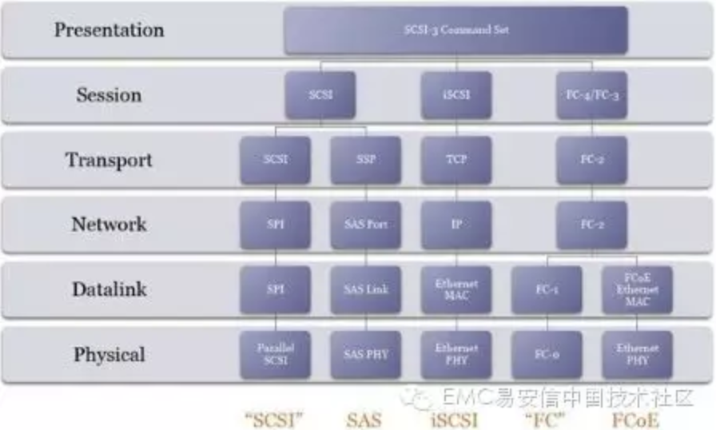

# iSCSI, FC和FCoE的比较和适用场景

iSCSI, FC和FCoE都是目前SAN网络上存储设备的主流连接方式，那这三种协议各自间的优缺点是什么，各自的适用场景如何？

FC是部署最多的SAN协议了，大家都很熟悉。iSCSI和FCoE都运行在以太网上，因此可以帮助企业节省IT架构的投入成本和复杂度。特别是iSCSI，可以直接沿用企业现有的IT架构，对很多中小型企业这是不可忽视的优势。

这三种协议工作在不同的网络层(见下图)。FCoE起步就是10Gb以太网；而iSCSI可以工作在1Gb或10Gb以太网；FC则有2GB、4Gb或8GB。另外iSCSI支持software initiator，普通台式机也可以接入存储。

