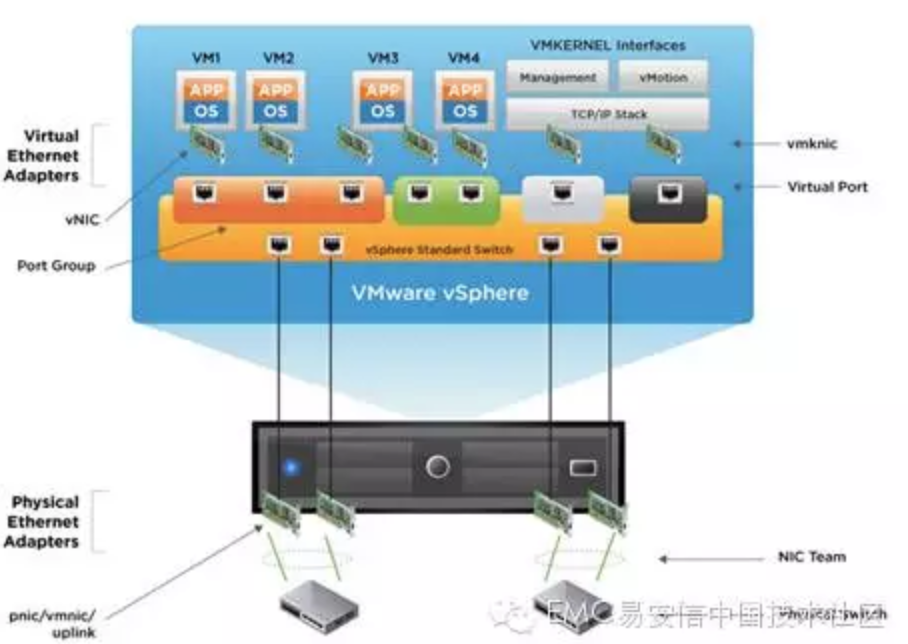
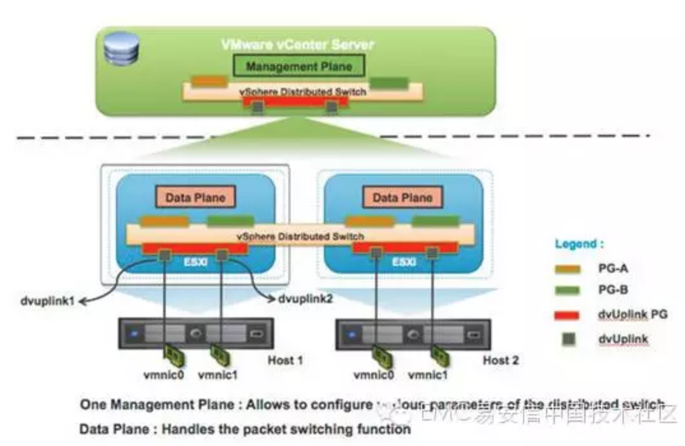

# 网络虚拟化（一）：简介

目前，软件定义的数据中心是一大热门技术，VMware作为全球最大的虚拟化厂商实现了通过软件可以定义应用及其所需的所有资源，包括服务器、存储、网络和安全功能都会实现虚拟化，然后组合所有元素以创建一个软件定义的数据中心。通过虚拟化可以减少服务器部署的时间和成本，可以实现灵活性和资源利用率的最大化，可以在调配虚拟机时对环境进行自定义，在软件定义的数据中心里虚拟机可以跨越物理子网边界。小编作为一名虚拟化技术爱好者，将通过系列文章来介绍软件定义数据中心里的网络虚拟化。

传统的网络在第2层利用VLAN来实现广播隔离，在以太网数据帧中使用12位的VLAN ID将第二层网络划分成多个广播域，VLAN数量需少于4094个。但随着虚拟化的普及，4094个的数值上限面临着巨大压力。此外，由于生成树协议（STP）的限制，极大的限制了可以使用的VLAN 数量。基于VXLAN的网络虚拟化解决了传统物理网络面临的诸多难题。

网络虚拟化可将网络抽象化为一个广义的网络容量池。因此便可以将统一网络容量池以最佳的方式分割成多个逻辑网络。您可以创建跨越物理边界的逻辑网络，从而实现跨集群和单位的计算资源优化。不同于传统体系架构，逻辑网络无需重新配置底层物理硬件即可实现扩展。VMware网络虚拟化是通过虚拟可扩展局域网（VXLAN）技术，创建叠加在物理网络基础架构之上的逻辑网络。

VMware网络虚拟化解决方案满足了数据中心的以下几大需求：

- 提高计算利用率
- 实现集群的扩展
- 跨数据中心内多个机架利用容量
- 解决IP寻址难题
- 避免大型环境中VLAN数量剧增问题
- 实现大规模多租户

通过采用网络虚拟化，可以有效的解决这些问题并实现业务优势：

- 加快网络和服务的调配速度，实现业务敏捷性。
- 将逻辑网络与物理网络分离，提供充分的灵活性。
- 大规模隔离网络流量并将其分段。
- 自动执行可重复的网络和服务调配工作流。

