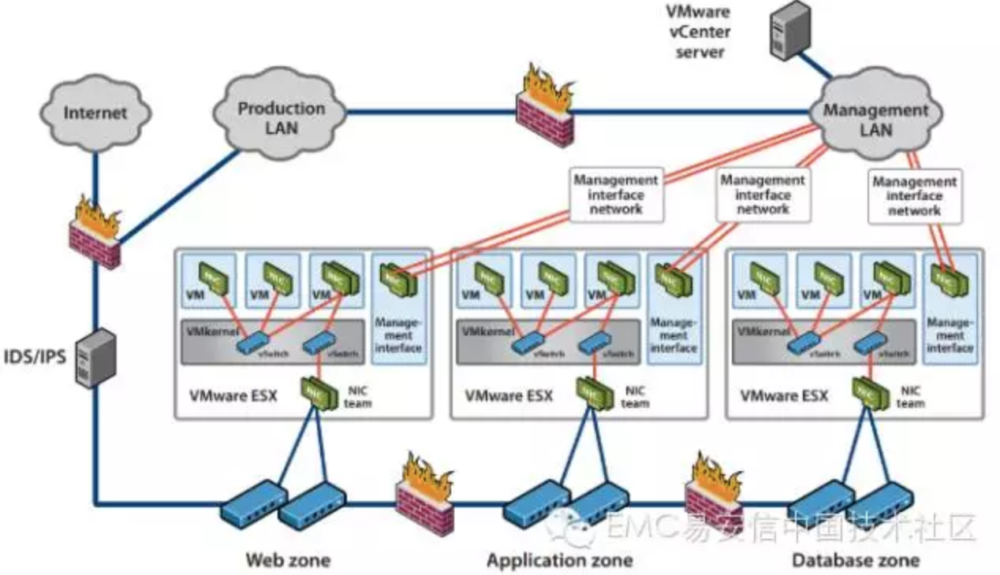
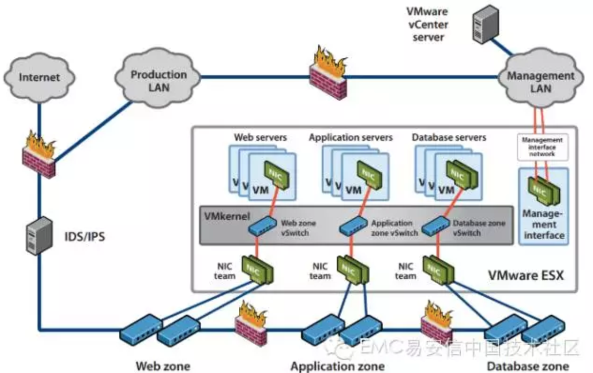
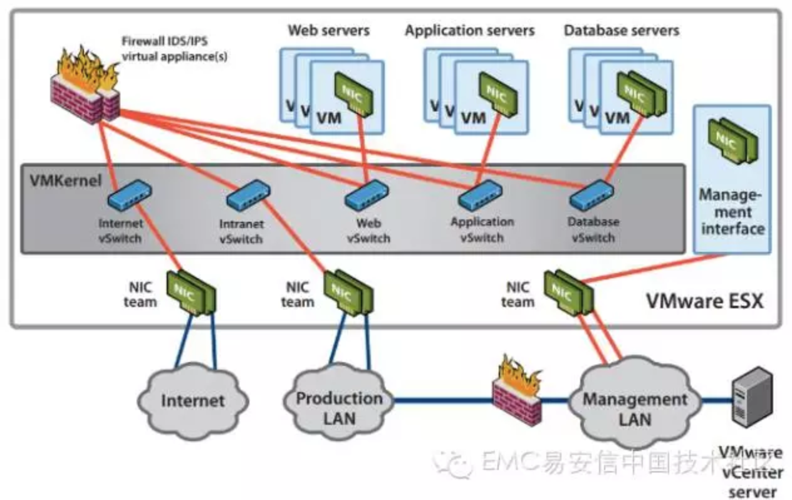

# 网络虚拟化（五）：通过划Zone来提高虚拟网络的安全性

虚拟网络为数据中心的建设和运营提供了显著优势，但同时也带来了新的安全问题。本文将介绍通过划Zone来提高虚拟网络的安全性。

虚拟环境面临的最常见威胁是不安全的接口和网络、过高的权限、错误配置或不当管理，以及未打补丁的组件。由于虚拟机是直接安装在服务器硬件上的，因此许多常规安全漏洞并不存在太大的安全威胁。在vSphere环境中，必须保护好以下基本组件：

- 物理网络和虚拟网络
- 基于IP的存储和光纤通道
- 物理和虚拟应用服务器以及应用客户端
- 托管虚拟机的所有ESXi系统
- 数据中心内的所有虚拟机
- 虚拟机上运行的应用程序

划Zone是保护物理网络和虚拟网络的一种有效方法。Zone定义了一个网段，在网段中的数据流入和流出都将受到严格的控制。在虚拟网络中，常见的划Zone方式有以下三种：

### 1、通过物理设备实现分离

在这种配置中，每个区域都采用单独的ESXi物理主机或集群，区域隔离是通过服务器的物理隔离和物理网络安全设定来实现的。这种配置方法较为简单，复杂度较低，不需要对物理环境进行调整，是一种将虚拟技术引入网络的好办法。但是，这种配置方法会制约虚拟化提供的优势，资源整合率和利用率较低，使用成本较高。

### 2、通过虚拟技术实现分离

在这种配置中，通过使用虚拟交换机可以将虚拟服务器连接到相应的区域，在同一台ESXi主机上设置不同信任级别的虚拟服务器，这种区域是在虚拟化层中实施的。虽然这种方法可以实现在物理机和虚拟领域实施不同的安全设定，但是仍然需要通过物理硬件来确保区域之间的网络安全。虽然在每个区域中都显示了不同的虚拟交换机，但是用户仍然可以使用VLAN以及单个虚拟交换机上不同的端口组实现相同的目的。

这种方法较好的整合了物理资源，能较好地利用虚拟化优势，成本较低。然而，与采用物理设备实现分离相比，这种配置较为复杂，必须明确配置人员，需要定期审核配置。

### 3、完全合并再分离

这是一种建立在完全虚拟前提下的隔离。用户可以将不同安全级别的虚拟机置于不同物理服务器上，并将网络安全设备引入虚拟基础架构。通过虚拟网络设备实现管理和保护虚拟信任域之间的通行。例如：通过VMware的vShield组件，可以为不同区域建立通信，同时监控通信。

这种配置中，所有的服务器和安全设备都进行了虚拟化，用户可以隔离虚拟服务器和网络，使用虚拟安全设备管理不同区域之间的通信。这是配置能够充分利用资源，减低成本，通过单个管理工作站管理整个网络，但是配置和管理最为复杂，出错几率较高。

