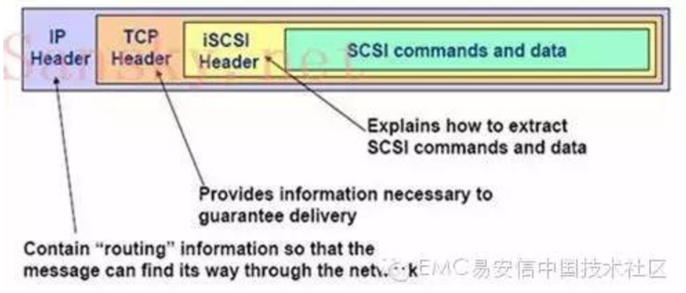
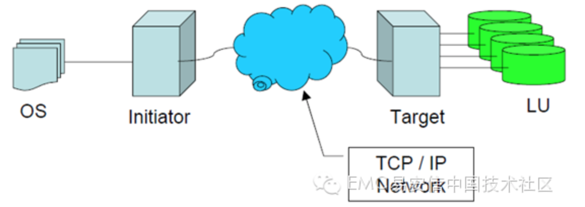

## iSCSI存储系统基础知识（一）

iSCSI是由Cisco和 IBM两家发起的，2003年2月由IETF（互联网工程任务组）认证通过，是一项比较成熟的技术。它将SCSI命令封装在TCP/IP包里，并使用一个iSCSI帧头。它基于IP协议栈，假设以不可靠的网络为基础，依靠TCP恢复丢失的数据包。

本些列作为iSCSI系统的基础读物，覆盖以下内容：

1. 什么是iSCSI？
2. 它有哪些优点？
3. 它的发展现状如何？
4. 它的架构和组件是怎样的？
5. 它的部署模式如何？

## 背景

相比直连存储，网络存储解决方案能够更加有效地共享，整合和管理资源。从服务器为中心的存储转向网络存储，一直依赖于数据传输技术的发展，速度要求与直连存储相当，甚至更高，同时需要克服并行SCSI固有的局限性。

所有数据在没有文件系统格式化的情况下，都以块的形式存储于磁盘之上。并行SCSI将数据以块的形式传送至存储，但是，对于网络它的用处相当有限，因为线缆不能超过25米，而且最多只能连接16个设备。

光纤通道是目前SAN的主导架构，它在专门的高速网络上分离存储资源。光纤通道协议与互联技术起源于满足高性能传送块数据的需求，同时克服直连存储的连接和距离限制。通常光纤通道设备连接距离可达到10000米，甚至数十万米，并且对于连接在SAN之上的设备没有数量要求。

与SAN不同，NAS将数据以文件的形式传输并且可以直接连接至IP网络。部署NAS设备传送数据库块数据，使用基于SCSI的光纤通道协议比Server Message Block(SMB)协议更加高效。

## 什么是iSCSI

iSCSI是一种使用TCP/IP协议在现有IP网络上传输SCSI块命令的工业标准，它是一种在现有的IP网络上无需安装单独的光纤网络即可同时传输消息和块数据的突破性技术。iSCSI基于应用非常广泛的TCP/IP协议，将SCSI命令/数据块封装为iSCSI包，再封装至TCP 报文，然后封装到IP 报文中。iSCSI通过TCP面向连接的协议来保护数据块的可靠交付。由于iSCSI基于IP协议栈，因此可以在标准以太网设备上通过路由或交换机来传输。

iSCSI架构依然遵循典型的SCSI模式：随着光纤通道的发明initiator和target之间的SCSI线缆已被光线线缆所代替。现在随着iSCSI的出现光纤线缆又被价格低廉的网线和TCP/IP网络所替代。

虽然现有的光纤存储网络具有高吞吐量的优势，与其他厂商之间的互通性仍是一个短板。而基于成熟的TCP/IP协议的iSCSI网络，不仅免于互通性限制而且在安全性等方面具备优势。同时，由于千兆以太网的增量部署，iSCSI的吞吐量也会随之增加，与光线通道匹敌甚至超越光线通道。

## iSCSI的优势

iSCSI的优势包括：

### 长距离连接

SAN网络集中管理存储资源，能够覆盖一个市区范围。对于分布在海外的组织则面临一系列未连接的“SAN孤岛”，当前的光纤通道连接受限于10km而无法桥接。有扩展的光纤通道连接可达数百公里，但这些方法既复杂又昂贵。广域网iSCSI (wide area network, WAN)提供了一种经济的长距离传输，可用于目前FC SAN或iSCSI SAN的桥接。

### 更低成本

不同于FC SAN解决方案需要部署全新的网络基础架构，并且需要专业技术知识，专门的硬件故障排查，iSCSI SAN解决方案充分利用了现有的局域网基础设施，使之可广泛应用于大多数组织。

### 简化部署和实施

iSCSI解决方案仅需要在主机服务器上安装iSCSI initiator，一个iSCSI target存储设备，一个千兆比特以太网交换机以在IP网络传输块数据。诸如存储配置，调配，备份这样的管理操作可由系统管理员处理，与管理直连存储方式相同。而像集群这样的解决方案使用iSCSI也比FC更为简易。

### 固有的安全性

光纤通道协议并没有内嵌的安全保障。取而代之，通过对SAN的物理连接限制来保障安全。虽然对于被限制在加锁的数据中心的SAN来说是有效的，但随着FC协议变得更加广为人知以及SAN开始连接到IP网络，这种安全方法已失去其功效。

相比之下，微软实施的iSCSI协议使用质询握手身份验证协议（CHAP）进行验证和Internet协议安全（IPSec）标准加密为网络上的设备提供安全保障。目前，iSCSI target实现了CHAP，但暂时没有更加先进的方法。

## iSCSI的现状与挑战

iSCSI这几年来得到了快速发展，近两年iSCSI的热度持续走高，各存储设备厂商纷纷推出iSCSI设备，销量也在快速增长。基于iSCSI的SAN现在已经相对成熟。10Gbps以太网的出现极大地改变了iSCSI的传输速率，大多数应用的响应能力完全可以适应用户的需求。同时iSCSI产品的采购成本与维护成本都比FC要低。

但是，iSCSI仍受到几个掣肘：iSCSI架构于IP协议之上，因此也继承了IP协议本身的缺陷：区分不同流量优先等级，防止丢包的QoS与流量控制机制不足，而FCoE在这一点上，具备暂停帧需求和将高优先级流量先于低优先级流量传输的功能，无疑具有先天的优势。即使带宽提升到10Gb，TCP/IP协议管理方面的问题在仍会影响iSCSI的效率表现。 此外，以太网带宽扩展到10Gb只是外部传输通道的增加，如果主机I/O处理能力、存储阵列性能无法跟上，则存储网络整体性能同样会受到影响。目前iSCSI在高I/O环境下的性能表现仍不如光纤通道。