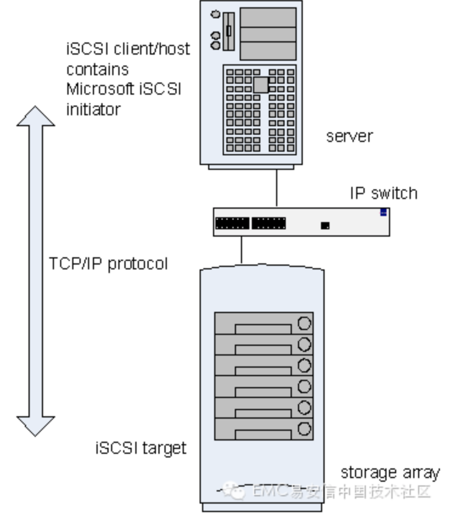
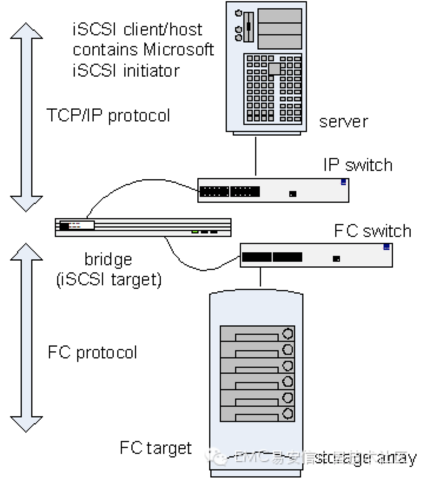

# iSCSI存储系统基础知识（二）

## iSCSI SAN概念解析

iSCSI SAN组件与FC SAN组件相类似。包括以下部件：

**iSCSI Client/Host：**

系统中的iSCSI客户端或主机（也称为iSCSI initiator），诸如服务器，连接在IP网络并对iSCSI target发起请求以及接收响应。每一个iSCSI主机通过唯一的IQN来识别，类似于光纤通道的WWN。

要在IP网络上传递SCSI块命令，必须在iSCSI主机上安装iSCSI驱动。推荐通过GE适配器（每秒1000 megabits）连接至iSCSI target。如同标准10/100适配器，大多数Gigabit适配器使用Category 5 或Category 6E线缆。适配器上的各端口通过唯一的IP地址来识别。

## iSCSI Target

iSCSI target是接收iSCSI命令的设备。此设备可以是终端节点，如存储设备，或是中间设备，如IP和光纤设备之间的连接桥。

每一个iSCSI target通过唯一的IQN来标识，存储阵列控制器上（或桥接器上）的各端口通过一个或多个IP地址来标识。

## 本机与异构IP SAN

iSCSI initiator与iSCSI target之间的关系如图1所示。本例中，iSCSI initiator(或client)是主机服务器而iSCSI target是存储阵列。此拓扑称为本机iSCSI SAN,它包含在TCP/IP上传输SCSI协议的整个组件。

与之相反，异构IP SAN，如下图所示，包含在TCP/IP与光纤交换结构传输SCSI的组件。为了实现这一点，需要在IP与光纤通道之间安装连接桥或网关设备。连接桥用于TCP/IP与光纤通道之间的协议转换，因此iSCSI主机将存储看做iSCSI target。直接连接光纤通道target的服务器必须包含HBA而不是iSCSI主机的网络适配卡。iSCSI主机可使用NIC或HBA。

## iSCSI 存储系统四大架构

### 控制器系统架构

iSCSI的核心处理单元采用与FC光纤存储设备相同的结构。即采用专用的数据传输芯片、专用的RAID数据校验芯片、专用的高性能cache缓存和专用的嵌入式系统平台。打开设备[机箱]()时可以看到iSCSI设备内部采用无线缆的背板结构，所有部件与背板之间通过标准或非标准的插槽链接在一起，而不是普通PC中的多种不同型号和规格的线缆链接。

控制器架构iSCSI存储内部基于无线缆的背板链接方式，完全消除了链接上的单点故障，因此系统更安全，性能更稳定。一般可用于对性能的稳定性和高可用性具有较高要求的在线存储系统，比如：中小型数据库系统，大型数据的库备份系统，远程容灾系统，网站、电力或非线性编辑制作网等。

### 连接桥系统架构

整个iSCSI存储系统架构分为两个部分，一个部分是前端协议转换设备，另一部分是后端存储。结构上类似NAS[网关]()及其后端存储设备。

前端协议转换部分一般为硬件设备，主机接口为千兆以太网接口，磁盘接口一般为SCSI接口或FC接口，可连接SCSI[磁盘阵列]()和FC存储设备。通过千兆以太网主机接口对外提供iSCSI数据传输协议。

后端存储一般采用SCSI[磁盘阵列]()和FC存储设备，将SCSI磁盘阵列和FC存储设备的主机接口直接连接到iSCSI桥的磁盘接口上。

iSCSI连接桥设备本身只有协议转换功能，没有RAID校验和快照、卷复制等功能。创建RAID组、创建LUN等操作必须在存储设备上完成，存储设备有什么功能，整个iSCSI设备就具有什么样的功能。

### PC系统架构

即选择一个普通的、性能优良的、可支持多块磁盘的PC(一般为PC[服务器]()和工控服务器)，选择一款相对成熟稳定的iSCSI target软件，将iSCSI target软件安装在PC服务器上，使普通的PC服务器转变成一台iSCSI存储设备，并通过PC服务器的以太[网卡]()对外提供iSCSI数据传输协议。

在PC架构的iSCSI存储设备上，所有的RAID组校验、逻辑卷管理、iSCSI 运算、TCP/IP 运算等都是以纯软件方式实现，因此对PC的[CPU]()和[内存]()的性能要求较高。另外iSCSI存储设备的性能极容易收PC服务器运行状态的影响。

### PC+NIC系统架构

PC+iSCSI target软件方式是一种低价低效比的iSCSI存储系统架构解决方案，另外还有一种基于PC+NIC的高阶高效性iSCSI存储系统架构方案。

这款iSCSI存储系统架构方案是指在PC服务器中安装高性能的TOE智能NIC卡，将CPU资源较大的iSCSI运算、TCP/IP运算等数据传输操作转移到智能卡的硬件芯片上，由智能卡的专用硬件芯片来完成iSCSI运算、TCP/IP运算等，简化网络两端的[内存]()数据交换程序，从而加速数据传输效率，降低PC的CPU占用，提高存储的性能。