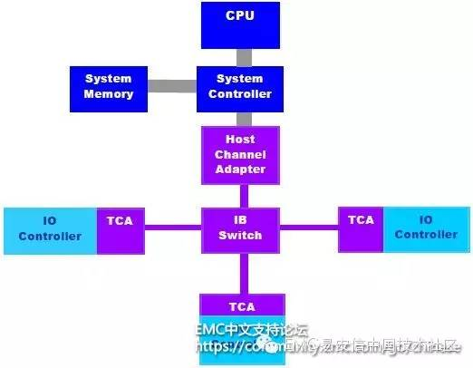
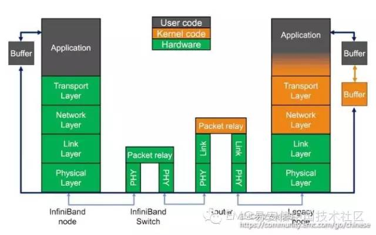
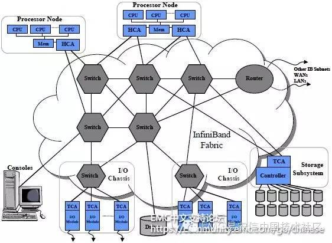
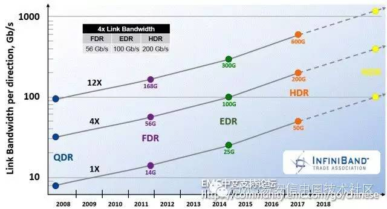

## InfiniBand技术简介

随着CPU和通讯处理速度的不断加快，10Gbps、100Gbps的逐步普及，传统的I/O标准和系统，例如PCI、Ethernet、Fibre Channel可能已经无法跟上脚步。因此如何将旧有的设备或产品升级为高速的通讯系统，正是IT从业者目前普遍苦恼的问题。

InfiniBand标准（简称IB）的出现就是为了解决PCI等传统I/O架构的通讯传输瓶颈。该标准采用点对点架构，提高容错性和扩展性，在硬件上实现10Gbps的数据传输（每个独立的链路基于四针的2.5Gbps双向连接），采用虚拟通道（Virtual Lane）实现QoS，同时借由CRC技术来保证信号的完整性。本文将介绍InfiniBand这一技术标准，以及它的主要组成部分。

## InfiniBand架构

InfiniBand采用双队列程序提取技术，使应用程序直接将数据从适配器送入到应用内存（称为远程直接存储器存取或RDMA）, 反之依然。在TCP/IP协议中,来自网卡的数据先拷贝到核心内存，然后再拷贝到应用存储空间，或从应用空间将数据拷贝到核心内存,再经由网卡发送到Internet。这 种I/O操作方式，始终需要经过核心内存的转换，它不仅增加了数据流传输路径的长度，而且大大降低了I/O的访问速度，增加了CPU的负担。而SDP则是将来自网卡的数据直接拷贝到用户的应用空间，从而避免了核心内存参与。这种方式就称为零拷贝，它可以在进行大量数据处理时，达到该协议所能达到的最大的吞吐量。

]

InfiniBand的协议采用分层结构，各个层次之间相互独立，下层为上层提供服务。其中物理层定义了在线路上如何将比特信号组成符号，然后再组成帧、数据符号以及包之间的数据填充等，详细说明了构建有效包的信令协议等；链路层定义了数据包的格式以及数据包操作的协议，如流控、 路由选择、编码、解码等；网络层通过在数据包上添加一个40字节的全局的路由报头（Global Route Header, GRH）来进行路由的选择，对数据进行转发。在转发的过程中，路由器仅仅进行可变的CRC校验,这样就保证了端到端的数据传输的完整性；传输层再将数据包传送到某个指定的队列偶（Queue Pair, QP）中，并指示QP如何处理该数据包以及当信息的数据净核部分大于通道的最大传输单元MTU时，对数据进行分段和重组。

]

## InfiniBand基本组件

]

InfiniBand的网络拓扑结构如上所示，其组成单元主要分为四类：

- HCA（Host Channel Adapter），它是连接内存控制器和TCA的桥梁
- TCA(Target Channel Adapter)，它将I/O设备（例如网卡、SCSI控制器）的数字信号打包发送给HCA
- InfiniBand link，它是连接HCA和TCA的光纤，InfiniBand架构允许硬件厂家以1条、4条、12条光纤3种方式连结TCA和HCA
- 交换机和路由器

无论是HCA还是TCA，其实质都是一个主机适配器，它是一个具备一定保护功能的可编程DMA（Direct Memory Access，直接内存存取 ）引擎。

## InfiniBand应用

在高并发和高性能计算应用场景中，当客户对带宽和时延都有较高的要求时，可以采用IB组网：前端和后端网络均采用IB组网，或前端网络采用10Gb以太网，后端网络采用IB。由于IB具有高带宽、低延时、高可靠以及满足集群无限扩展能力的特点，并采用RDMA技术和专用协议卸载引擎，所以能为存储客户提供足够的带宽和更低的响应时延。

IB目前可以实现以及未来规划的更高带宽工作模式有（以4X模式为例）：

- SRD (Single Data Rate)：单倍数据率，即8Gb/s
- DDR (Double Data Rate)：双倍数据率，即16Gb/s
- QDR (Quad Data Rate)：四倍数据率，即32Gb/s
- FDR (Fourteen Data Rate)：十四倍数据率，56Gb/s
- EDR (Enhanced Data Rate)：100 Gb/s
- HDR (High Data Rate)：200 Gb/s
- NDR (Next Data Rate)：1000 Gb/s+

]