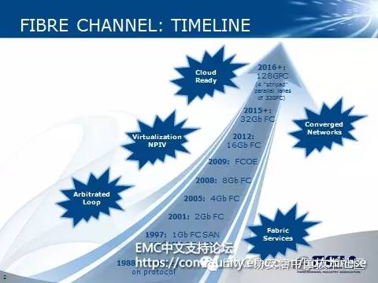

## 新的业务环境对光纤通道的需求——浅谈第六代光纤通道标准

光纤通道行业协会（FCIA）公布了代表业内最快行业标准网络协议的第六代光纤通道（Gen 6 Fibre Channel）协议，它能够使SAN网络的速度达到128G，并具备提供更高网络可靠性、更高能效和更简便操作性的功能。第六代光纤通道协议是旨在提供满足超大规模虚拟化、SSD 存储技术和新数据中心架构的性能、可靠性和可扩展性等需求的下一代光纤通道协议。解决方案预计将在 2016 年广泛上市。

本文将谈谈新的业务环境对光纤通道的需求，即为什么要推出第六代光纤通道标准。

]

## 新的业务环境对光纤通道的需求

新的不断变化的关键工作负载、更高密度的虚拟化和基于云的架构继续使SAN基础架构一再突破极限。此外，基于SSD的存储等新技术和新的第六代光纤通道技术存储阵列将重点从存储转移到了互连上。这一趋势要求更高的输入/输出（I/O）和带宽，进而推动着对更高速度和更可靠网络的需求。一系列服务器和存储趋势及技术进步成果使第六代光纤通道技术需求水涨船高，包括：

- 更多、更大的应用

所有计算环境快速增长，导致软件应用越来越大，数量越来越多。信息数字化、富媒体的日益普及和交互式Web 2.0应用快速发展，推动着对更高存储容量和带宽的要求。从移动接入到电子邮件再到云计算，需要我们在更远的距离上高速传输数据。此外，数据库等应用和其它关键任务应用快速增长，继续要求从不间断的可用性。随着维护窗口日益缩短或彻底消失，会影响数据接入的性能问题或故障停机变得无法容忍。存储网络必须做好准备，提供更高的容量、吞吐量和弹性。

- 高密度服务器虚拟化

光纤通道刚面世时，一台服务器专用于某一种应用，导致服务器资源利用率很低。服务器虚拟化技术的面世改变了这一局面，允许多种应用共享同一台物理服务器，进而提高了效率和服务器资源利用率。最近的IT支出意向调查显示，连续两年，服务器虚拟化的更广泛普及是IT部门的首要重点之一。今天，不断演进的关键工作负载和Tier 1应用正被托管到虚拟机上。除了服务器虚拟化的更广泛普及外，虚拟机密度（每台物理服务器上托管的虚拟机数量）也稳步增长，达到了每物理服务器10、20甚至更多虚拟机——它们都从SAN中启动并接入SAN资源。虚拟机的使用范围和重要性不断增加，密度不断提高，日益要求存储计算基础架构提供更高的性能（带宽和I/O）、可靠性和可用性。在高度虚拟化环境中，存储网络中的任何拥塞、低劣的I/O性能或故障都会影响到大量应用。

- 固态硬盘（SSD）和闪存

闪存和SSD的面世使存储技术突飞猛进，大大缩短了服务器侧（使用多核处理器和更快速的内存）与存储侧之间由来已久的I/O性能差距。SSD存储可化解I/O和吞吐量瓶颈，为高密度虚拟化工作负载和传统的关键任务应用提供更快速的数据块和文件存储性能。然而，这以存储网络能跟上发展步伐为前提。不管是部署为基于SSD的独立阵列还是直接连接到服务器CPU和内存总线，SSD均可提高I/O性能，更加需要存储网络提供更高的I/O带宽性能和更高的可用性。

## 第六代光纤通道标准

第六代光纤通道协议是旨在提供满足超大规模虚拟化、SSD 存储技术和新数据中心架构的性能、可靠性和可扩展性等需求的下一代光纤通道协议。它包括了下面六个新特性：

1. 32GFC至128GFC的数据吞吐量：第六代光纤通道协议将3200 MB/s的16GFC数据吞吐量翻了一番，达到32GFC，这实现了6400 MB/s的全双工速度。第六代光纤通道协议还提供“将32 GFC翻两番，达到128GFC”的选项，从而实现基于光纤通道的无缝兼容和向下兼容技术的25600 MB/s的全双工速度。
2. 向前纠错（FEC）：通过自动检测以及发生于高速网络的位错误恢复功能来提高链路可靠性。FEC有助于尽量减少或避免可导致应用程序性能下降或中断的数据流错误。
3. 能效：通过允许光纤通道光连接器在待机模式（或“休眠”模式）每秒多次运行而实现较低的能耗。
4. NPIV（N-Port ID Virtualization）支持：NPIV技术可以简化服务器虚拟化的部署，并且支持扩展至超大型的SAN网络。
5. 向后兼容性：128G和32G光纤通道可支持全面、彻底向后兼容16G和8G网络。为确保完整的投资保护，第六代光纤通道技术可在任何两个网络点之间自动配置到最快支持速度，并且不需要任何用户干预。
6. 加强的安全性：第六代光纤标准采用了许多知名的安全和保护标准，如FC-SP、FC-SP-2和FC-SP-2/AM1。这使得它仍然支持包括美国国家标准技术研究所（NIST）和欧盟（EU）在内的国际组织的标准。