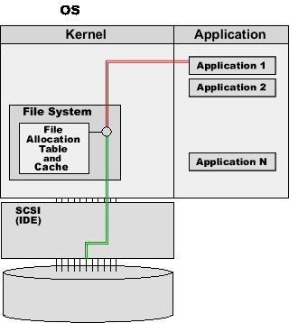
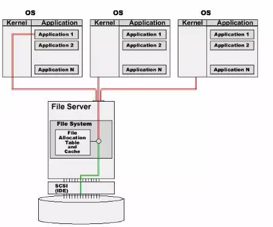
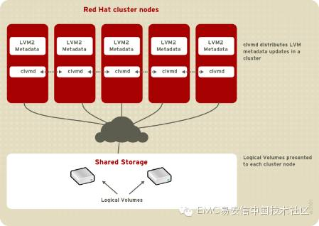
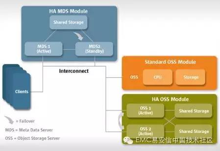
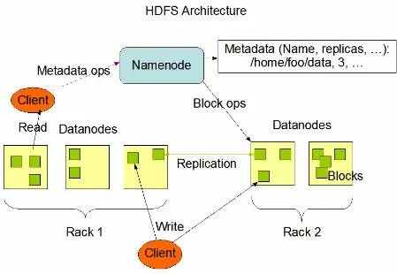
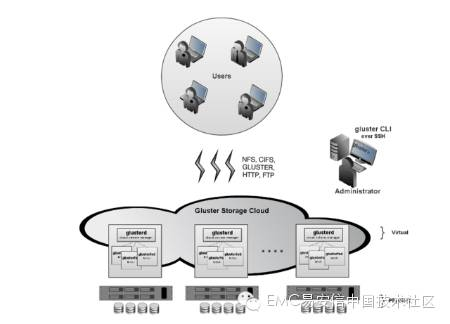

# 分布式文件系统发展史（内含动态图片）

分布式存储在大数据、云计算、虚拟化场景都有勇武之地，在大部分场景还至关重要。

对于一个IT从业人员，学习分布式存储相关基础知识必不可少。

今天给大家简要介绍*nix平台下分布式文件系统的发展历史。

## 单机文件系统

用于操作系统和应用程序的本地存储。

缺点：数据无法再服务器之间共享。

典型代表：Ext2、Ext3、Ex4、NTFS、FAT、FAT32、XFS、JFS...

IO模型：

## 网络文件系统（简称：NAS）

基于现有以太网架构，实现不同服务器之间传统文件系统数据共享。

缺点：两台服务器不能同时访问修改，性能有限。

典型代表：NFS、CIFS

IO模型：

## 集群文件系统

在共享存储基础上，通过集群锁，实现不同服务器能够共用一个传统文件系统。

缺点：性能一般，扩展性很有限（小于16台服务器）。

典型代表：GFS（Redhat）、GFS2（Redhat）、OCFS（Oracle）

IO模型：

GFS、GFS2模型如下：

默认上面三种文件系统模块都位于内核里面，NFS over Inifiband可以使用kernel bypass绕开内核。

## 分布式文件系统

在传统文件系统上，通过额外模块实现数据跨服务器分布，并且自身集成raid保护功能，可以保证多台服务器同时访问、修改同一个文件系统。性能优越，扩展性很好，成本低廉。

缺点：适用场景单一，部分类型存在单点故障风险。

典型代表：lustre（Oracle）、HDFS（ASF）、gluster（Redhat）

IO模型：

主要分两大类型：一种是元数据集中管理模型；另一种是元数据分散管理模型

lustre（Oracle）

## HDFS（ASF）

lustre和HDFS是元数据集中管理典型代表。实际数据分布存放在数据服务器上，元数据服务器负责IO请求调配，空间分配；非常适用于大文件存储。

元数据服务器可能成为系统扩展的瓶颈。

## gluster（Redhat）

gluster是元数据分散管理模型典型代表，元数据被分散放置到所有服务器上，不存在元数据单点故障。非常适用于小文件存储。