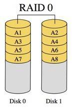
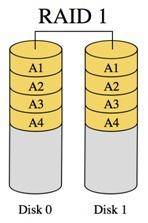
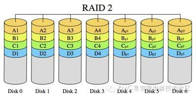
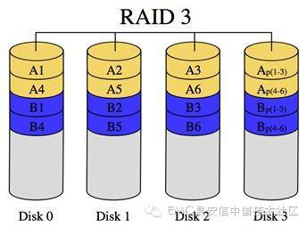
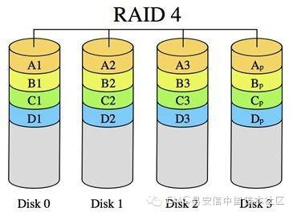
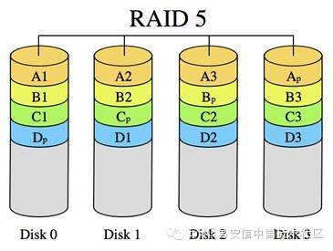
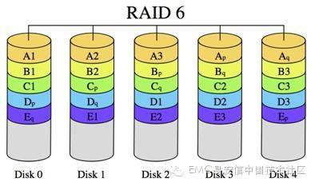
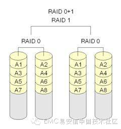
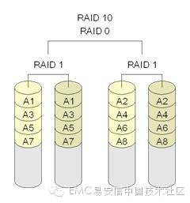

# RAID 类型介绍

**RAID** (Redundant Array of Independent/Inexpensive Disks)，独立磁盘冗余阵列，是一种将多块独立的硬盘（物理硬盘）按不同的组合方式形成一个硬盘组（逻辑硬盘），从而提供比单块硬盘更大的存储容量、更高的可靠性和 更快的读写性能等。该概念最早由加州大学伯克利分校的几名教授于1987年提出。早期主要通过RAID控制器等硬件来实现RAID磁盘阵列，后来出现了基于软件实现的RAID，比如mdadm等。按照磁盘阵列的不同组合方式，可以将RAID分为不同级别，包括RAID0到RAID6等7个基本级别，以及 RAID0+1和RAID10等扩展级别。不同RAID级别代表着不同的存储性能、数据安全性和存储成本等。下面我们将分别介绍这几种RAID级别。

**RAID 0：** 简单地说，RAID0主要通过将多块硬盘“串联”起来，从而形成一个更大容量的逻辑硬盘。RAID0通过“条带化（striping）”将数据分成不同的 数据块，并依次将这些数据块写到不同的硬盘上。因为数据分布在不同的硬盘上，所以数据吞吐量得到大大提升。但是，很容易看出RAID0没有任何数据冗余， 因此其可靠性不高。

**RAID 1：**如果说RAID 0是RAID中一种只注重存储容量而没有任何容错的极端形式，那么RAID1则是有充分容错而不关心存储利用率的另一种极端表现。RAID1通过“镜像 （mirroring）”，将每一份数据都同时写到多块硬盘（一般是两块）上去，从而实现了数据的完全备份。因此，RAID1 支持―“热替换”，在不断电的情况下对故障磁盘进行更换。一般情况下，RAID1 控制器在读取数据时支持负载平衡，允许数据从不同磁盘上同时读取，从而提高数据的读取速度；但是，RAID1在写数据的性能没有改善。

**RADI 2：**RAID 2以比特（bit）为单位，将数据―“条带化（striping）”分布存储在不同硬盘上；同时，将不同硬盘上同一位置的数据位用海明码进行编码，并将这些 编码数据保存在另外一些硬盘的相同位置上，从而实现错误检查和恢复。因为技术实施上的复杂性，商业环境中很少采用RAID2。

**RAID 3：**与RAID 2类似，不同的是：1）以字节（byte）为单位进行―条带化‖处理；2）以奇偶校验码取代海明码。RAID3的读写性能都还不错，而且存储利用率也相当高，可达到(n-1)/n。但是对于随即读写操作，奇偶盘会成为写操作的瓶颈。

**RAID 4：**与RAID 3的分布结构类似，不同的是RAID 4以数据块（block）为单位进行奇偶校验码的计算。另外，与RAID2和RAID3不同的是，RAID4中各个磁盘是独立操作的，并不要求各个磁盘的磁头同步转动。因此，RAID4允许多个I/O请求并行处理。

**RAID 5: **RAID 3和RAID 4都存在同一个问题，就是奇偶校验码放在同一个硬盘上，容易造成写操作的瓶颈。RAID5与RAID4基本相同，但是其将奇偶校验码分开存放到不同的硬盘上去，从而减少了写奇偶校验码带来瓶颈的可能性。

**RAID 6：**在RAID 5的基础上，RAID 6又另外增加了一组奇偶校验码，从而获得更高的容错性，最多允许同时有两块硬盘出现故障。但是，新增加的奇偶校验计算同时也带来了写操作性能上的损耗。

**RAID 0+1: **为了获取更好的I/O吞吐率或者可靠性，将不同的RAID标准级别混合产生的组合方式叫做嵌套式RAID，或者混合RAID。RAID0+1是先将硬盘分 为若干组，每组以RAID0的方式组成―条带化‖的硬盘阵列，然后将这些组RAID0的硬盘阵列以RAID1的方式组成一个大的硬盘阵列。

**RAID 10: **类似于RAID 0+1， RAID 10则是先“镜像”（RAID 1）、后“条带化”（RAID0）。RAID0+1和RAID10性能上并无太大区别，但是RAID10在可靠性上要好于RAID0+1。这是因为在 RAID10中，任何一块硬盘出现故障不会影响到整个磁盘阵列，即整个系统仍将以RAID10的方式运行；而RAID0+1中，一个硬盘出现故障则会导致 其所在的RAID0子阵列全部无法正常工作，从而影响到整个RAID0+1磁盘阵列 – 在只有两组RAID0子阵列的情况下，整个系统将完全降级为RAID0级别。

